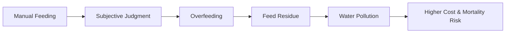
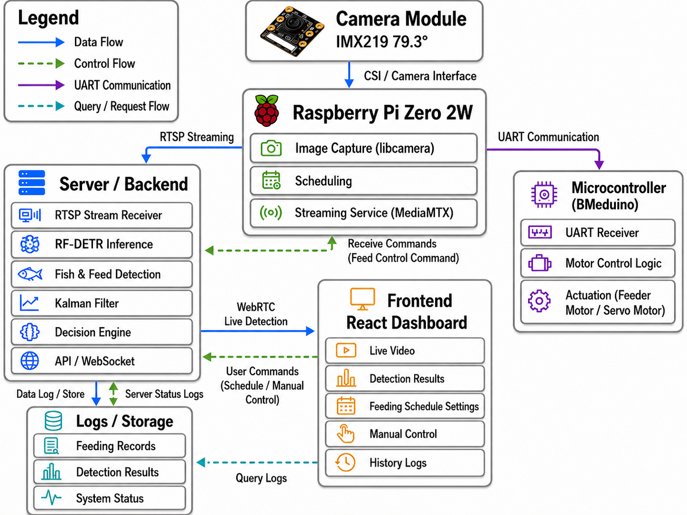
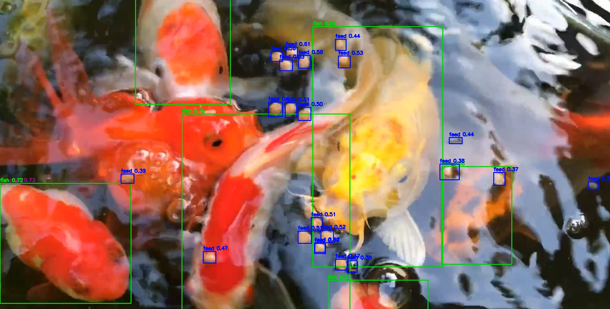
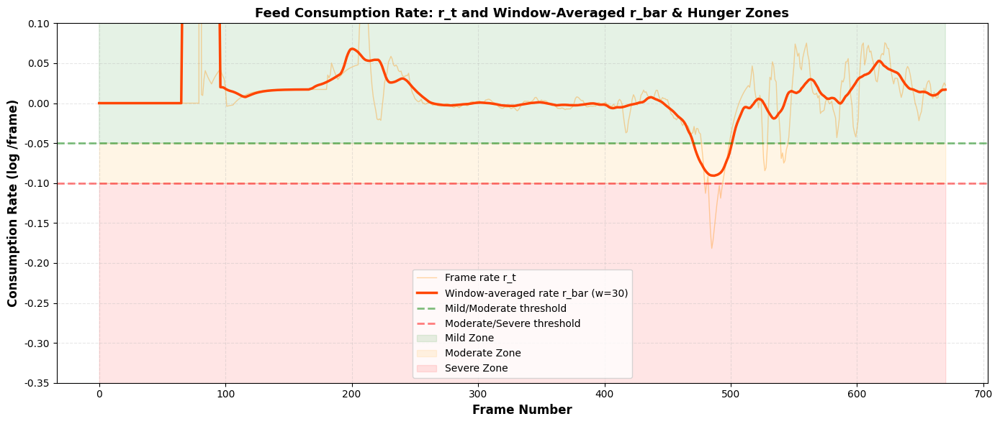
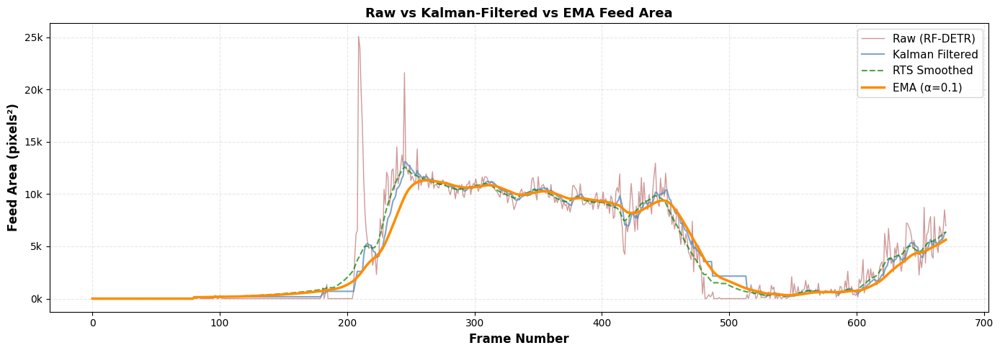

  
Smart Aquaculture / Embedded AI

  <h1>Automated Aquaculture Feeding Control</h1>
  
via RF-DETR Feed Recognition and Embedded Systems

CHENG-HSUN CHUANG · Sin-Ze Yang 
Chung Yuan Christian University 
Advisor: Prof. Yong-Xiang Chen

---
layout: two-cols
layoutClass: gap-12
---

# Motivation

Smart aquaculture needs better feeding decisions to reduce waste and improve production efficiency.

<v-clicks>

- Feed costs are a major operating expense
- Feed Conversion Ratio (FCR) directly affects profitability
- Manual feeding depends heavily on human experience
- Overfeeding pollutes water and increases mortality risk

</v-clicks>

::right::

  
FCR

  
Feed Conversion Ratio

  
A key indicator for balancing growth, cost, and environmental stability.

---

# Problem Statement

Traditional manual feeding often creates an unstable control loop.

The goal is to replace subjective feeding with data-driven, real-time feedback control.

---

# System Overview

The proposed system observes floating feed residue, estimates consumption behavior, and controls feeding dynamically.

  

System architecture from visual sensing to embedded feeding actuation.

---
layout: center
---

# Three-Phase Method

  

    
01

    <h3>Object Detection</h3>
    
RF-DETR detects surface feed residue and calculates per-frame pixel area.

  

  

    
02

    <h3>Signal Smoothing</h3>
    
Kalman Filter reduces noise from refraction, ripples, and fish movement.

  

  

    
03

    <h3>Feedback Control</h3>
    
Consumption rate is mapped to hunger levels for dynamic precision feeding.

  

---

# Phase 1: RF-DETR Feed Recognition

RF-DETR is used to detect floating feed residue in real time.

  

Key output:

- Detected feed residue location
- Pixel area per frame
- Time-series input for downstream filtering and control

---

# Phase 2: Kalman Filter

Aquaculture environments introduce unstable visual signals.

  
Light refraction

  
Water ripples

  
Sudden fish movement

  
Extreme outliers

The Kalman Filter estimates a smoother trajectory of feed area over time, making consumption trends more reliable for control decisions.

---

# Phase 3: Hunger Assessment

The system computes Feed Consumption Rate (CR) from filtered data.

$$
r_t = \log(\hat{\theta}_t) - \log(\theta_{t-1})
$$

$$
H_t =
\begin{cases}
\text{Mild}, & r_t > -0.05 \\
\text{Moderate}, & -0.1 < r_t \le -0.05 \\
\text{Severe}, & r_t \le -0.1
\end{cases}
$$

This maps visual consumption signals into actionable feeding control states.

---

# Results: CR-Frame Analysis

  

    <h3>What it shows</h3>
    
Feed Consumption Rate is calculated across frames and mapped to Hunger Zones.

    <ul>
      <li>Mild: low feeding demand</li>
      <li>Moderate: normal feeding demand</li>
      <li>Severe: high feeding demand</li>
    </ul>
  

  

    
  

---

# Results: Area-Frame Analysis

Area-frame analysis compares raw visual measurements with smoothed signals.

  

The smoothed signal suppresses extreme anomalies and supports more stable feeding decisions.

---

# Future Expectations

The system can be extended from a fixed feeding device to large-scale aquaculture operations.

<v-clicks>

- Integrate recognition and control algorithms with drones
- Support autonomous feeding vessels for mobile monitoring
- Enable wide-area precision feeding across large fish ponds
- Reduce labor cost and optimize resource allocation

</v-clicks>

---
layout: center
class: text-center
---

# Key Takeaways

  
RF-DETR detects surface feed residue

  
Kalman Filter stabilizes noisy visual signals

  
CR-based hunger zones enable feedback control

Toward automated, precise, and sustainable aquaculture feeding.

---
layout: center
class: text-center
---

# Thank You

Automated Aquaculture Feeding Control 
via RF-DETR Feed Recognition and Embedded Systems

Chung Yuan Christian University

